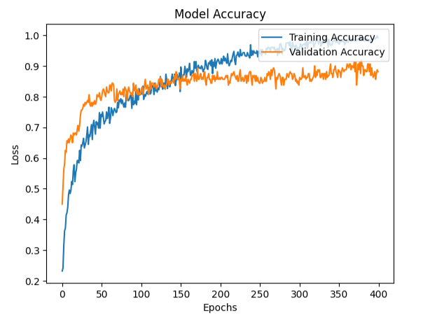
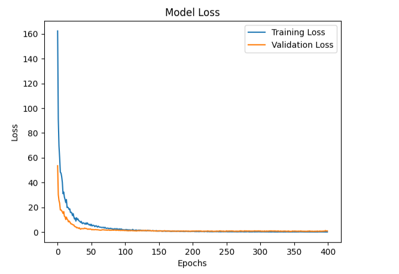
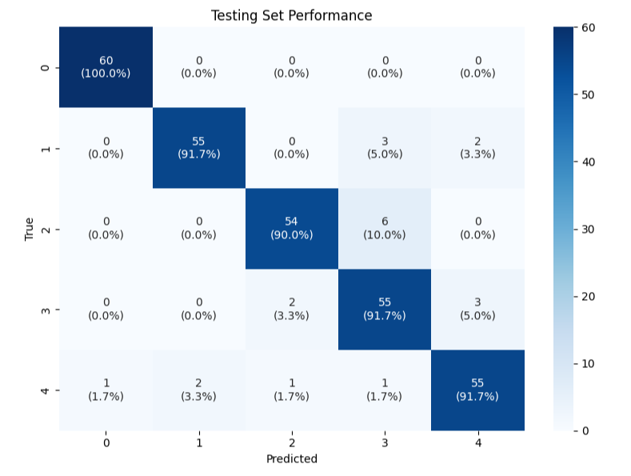

# 🌍 CNN-Based Remote Sensing Image Scene Classification


A deep learning project that performs **multispectral remote sensing image scene classification** using a custom-designed Convolutional Neural Network (CNN). The model is developed using TensorFlow/Keras and trained on multispectral satellite imagery to automatically classify land cover scenes.

---

## 📌 Project Overview

Remote sensing image classification plays an important role in

- Land use and land cover mapping
- Environmental monitoring
- Precision agriculture
- Urban planning
- Disaster management

This project develops a custom CNN architecture capable of learning spatial patterns from multispectral satellite imagery for scene classification.

---

## 🚀 Features

- Custom CNN architecture
- Multispectral image processing
- TensorFlow/Keras implementation
- Data preprocessing pipeline
- Stratified train-test split
- Model training and validation
- Performance visualization
- Confusion matrix generation
- Prediction on unseen images

---

## 🧠 CNN Architecture

The model consists of multiple convolutional blocks followed by pooling layers and fully connected layers.

Typical workflow:

```

Input Image
↓
Convolution Layer
↓
ReLU
↓
Max Pooling
↓
Convolution Layer
↓
ReLU
↓
Max Pooling
↓
Flatten
↓
Dense Layer
↓
Dropout
↓
Softmax Output

```

---

## 📂 Dataset

The notebook expects satellite images organized by class folders.

Example:

```

data/
├── Forest/
├── Water/
├── Urban/
├── Agriculture/
├── Grassland/
└── ...

```

> Large datasets are not included in this repository.

---

## 🛠 Technologies Used

- Python
- TensorFlow
- Keras
- NumPy
- Pandas
- Rasterio
- Matplotlib
- Scikit-learn

---

## 📊 Workflow

1. Import libraries
2. Read multispectral images
3. Image preprocessing
4. Data normalization
5. Train/Test split
6. Build CNN
7. Train model
8. Evaluate performance
9. Generate predictions

---

## 📈 Evaluation Metrics

The project evaluates the model using:

- Classification Accuracy
- Training Accuracy
- Validation Accuracy
- Training Loss
- Validation Loss
- Confusion Matrix

---

## 📷 Example Results

## 📈 Training Accuracy



---

## 📉 Training Loss



---

## 🔲 Confusion Matrix


---

## ⚙ Installation

Clone the repository

```bash
git clone https://github.com/yourusername/CNN-Remote-Sensing-Scene-Classification.git
```

Install dependencies

```bash
pip install -r requirements.txt
```

Launch Jupyter

```bash
jupyter notebook
```

---

## ▶ Running the Project

Open

```
CNN_Architecture.ipynb
```

Run each notebook cell sequentially.

---

## 📦 Requirements

Example

```
tensorflow
keras
numpy
pandas
matplotlib
scikit-learn
rasterio
opencv-python
```

---

## 📚 Applications

- Land cover classification
- Crop monitoring
- Forest mapping
- Wetland detection
- Urban expansion analysis
- Environmental monitoring

---

## 🔮 Future Improvements

- Transfer Learning (ResNet, EfficientNet)
- Vision Transformers
- Data Augmentation
- Hyperparameter Optimization
- Model Deployment with Streamlit
- Explainable AI using Grad-CAM

---

## 👨‍💻 Author

**Stephen Adebisi**

Graduate Researcher

Machine Learning • Deep Learning • GIS • Remote Sensing

GitHub: https://github.com/yourusername

LinkedIn: https://linkedin.com/in/yourprofile

---

## ⭐ If you found this project useful

Please consider giving the repository a ⭐.
